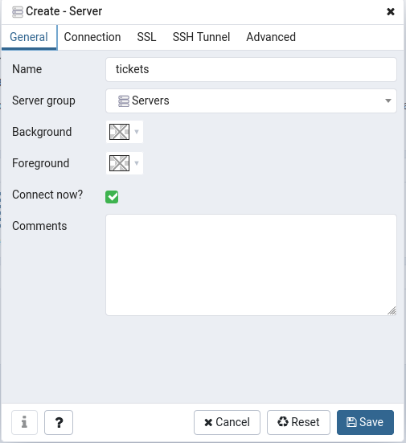
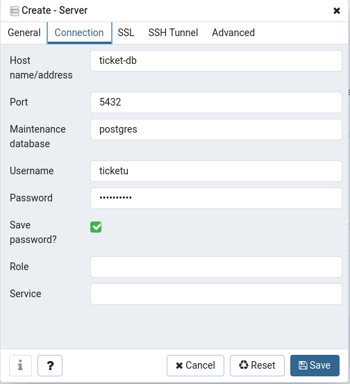

# Technology stack

I'm using **Spring Framework**, **Maven** and **Java 11** for the solution of this technical test. As a starting point I used [start.spring.io](start.spring.io) to generate a project.

## Solution

I've created a docker-compose file where I generate a network that all containers share. Then I add 3 containers, one for the database(**Postgres**), another for **pgAdmin** and the last one for the REST API itself.

## How to run

In order to run the solution, first run the following commands to build the jar file of the REST API:

```
cd tickets
./mvnw clean package
```

This uses a **Maven** wrapper so no need to install **Maven** if not installed. Then you can generate the images defined in the compose file running this command from the root directory:

```
docker-compose -f stack-compose.yml up --build --no-start
```
To run the containers:
```
docker-compose -f stack-compose.yml up -d
```

## How to use

For using the DB with **pgAdmin**, access [localhost:9000](localhost:9000) in a web browser.

Use this credential to login into **pgAdmin**:

```
ssansone@dataart.com
ticketpgpass
```

Once logged in, you need to generate a new server connection by right clicking the *Servers* option in the left pane explorer, then *Create - Server...*

Then generate the connection: 



The user and password for the DB:

```
ticketu
ticketpass
```



> It's possible to use the Docker container name instead of having to specify the IP of the running environment (since *localhost* would be the container's *localhost*) thanks to the network defined in the docker-compose file.

Now it's possible to verify in the DB the information loaded using the REST API.

The API exposes the following endpoints (assuming the docker-compose is run on local):

* `POST http://localhost:9000/tickets` create tickets
* `GET http://localhost:9000/tickets/{id}` get tickets using the id
* http://localhost:9000/api-docs This expose auto-generated open-api documentation
* http://localhost:9000/swagger.html This expose Swagger UI

The API can easily be used in **Postman** by importing open-api docs directly from URL.